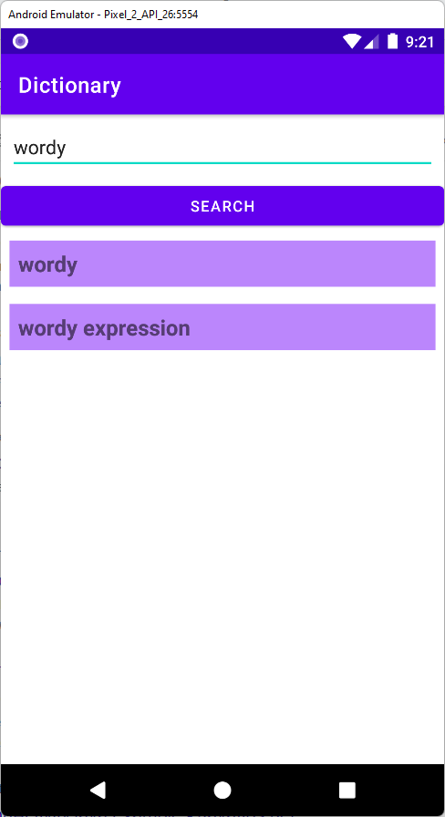

# Android: Pro development of apps@geekbrains (https://gb.ru/go/aPWYkD)
## Lesson1: MVP
new app: Dictionary: using "https://dictionary.skyeng.ru" with retrofit search for a word, save to DB using Room via Rx

### Preview

